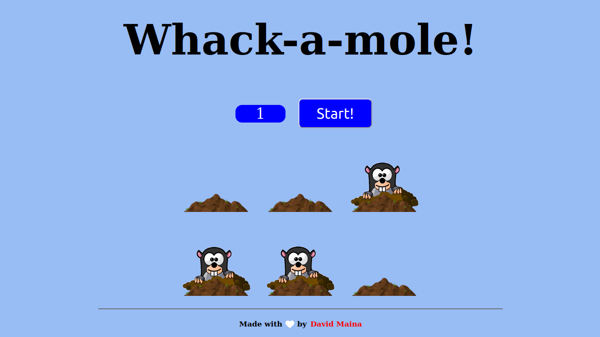

## JS Mole Game

This is a simple web-based game implemented in HTML5, CSS, and JavaScript. The game allows players to whack as many moles as they can within a certain time limit. This is a mouse or touchpad game and not suited for touch screen devices.

_The game in action._

## Features

- Animated random popping out of moles from holes
- Real-time feedback on number of whacks
- Time limit 

## Installation

1. Clone the repository: `git clone https://github.com/davymaish/mole-game.git`
2. Open the project directory.
3. Open the `index.html` file in your preferred web browser.

## How to Play

1. Click the "Start!" button to begin the game.
2. Moles will randomly pop up from their holes.
3. Use your mouse to click on the moles as quickly as possible.
4. Each mole you whack will earn you points.
5. Try to achieve the highest score within the given time limit.

## Contributing

Contributions are welcome! If you find any issues or have ideas for improvements, please open an issue or submit a pull request.

## License

This project is licensed under the [MIT License](LICENSE).

## Contact

For any inquiries or feedback, feel free to contact me via:

- Website: [davymaish.github.io](https://davymaish.github.io)
- Email: [davidmainadmg05@gmail.com](mailto:davidmainadmg05@gmail.com)

